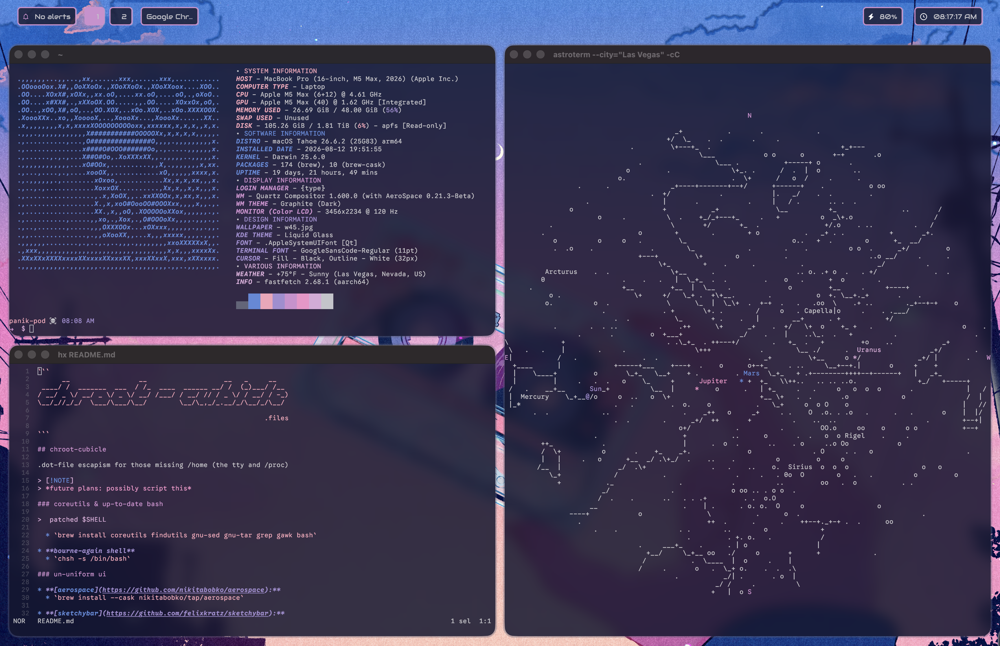

```
      __                 __                   __   _     __   
 ____/ /  _______  ___  / /_  ____  ______ __/ /  (_)___/ /__ 
/ __/ _ \/ __/ _ \/ _ \/ __/ /___/ / __/ // / _ \/ / __/ / -_)
\__/_//_/_/  \___/\___/\__/        \__/\_,_/_.__/_/\__/_/\__/ 
                                                    
                                                        .files

```

## chroot-cubicle

.dot-file escapism for those missing /home (the tty and /proc)


### coreutils & up-to-date bash

>  patched $SHELL

  * `brew install coreutils findutils gnu-sed gnu-tar grep gawk bash`
  
* **bourne-again shell**
  * `chsh -s /bin/bash`

### un-uniform ui

* **[aerospace](https://github.com/nikitabobko/aerospace):**  
  * `brew install --cask nikitabobko/tap/aerospace`

* **[sketchybar](https://github.com/felixkratz/sketchybar):** 
 `brew tap FelixKratz/formulae`
 `brew install sketchybar`

* **[jankyborders](https://github.com/felixkratz/jankyborders):** 
`brew tap FelixKratz/formulae`
`brew install borders`

### terminal & $EDITOR
> optional - comment out with your own preferences

* **[kitty](https://sw.kovidgoyal.net/kitty/):** 
  * `brew install --cask kitty`
  
* **[helix](https://helix-editor.com/):** 
  * `brew install helix`

### renice'd colorschemes

* **fastfetch:** - fetch
  * `brew install fastfetch`
  
* **pywal16 & gowall:** 
modify wallpapers & then theme everything not nailed down

  * `brew install pipx`
  * `pipx install pywal16`
  * `brew install gowall`
  
* **slk:** 
tui slack
  * `brew install --cask gammons/tap/slk`
  
> [!NOTE]
> includes pywal template for sketchybar & jankyborders 

### screenshot


